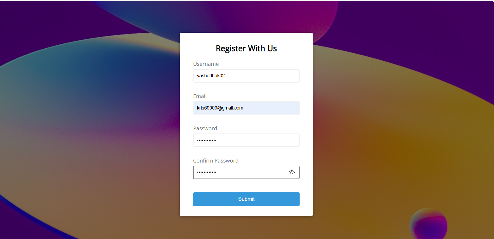

# ✍️ Form Validation in JavaScript - For Absolute Beginners

Simple client side form validation. Check required, length, email and password match

## Project Specifications

- Create form UI
- Show error messages under specific inputs
- checkRequired() to accept array of inputs
- checkLength() to check min and max length
- checkEmail() to validate email with regex
- checkPasswordsMatch() to match confirm password

## Error

## Success

## Please give this repo a ⭐ if you found it helpful.
